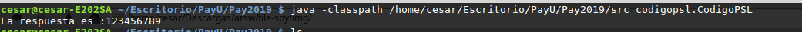

# Calcular el numero cifrado

## Solucion del ejercicio 
## 2019-1 
## Escuela Colombiana de Ingeniería Julio Garavito - Ingeniería de Sistemas
#### Programa para descifrar el numero codificado en un archivo .txt
---
### Autor
- Cesar E. Lanos Camacho
### Empresa PayU
---
---
### :book: Instrucciones
Porfavor para hacer uso del proyecto descargue o clone el proyecto en la parte derecha superior en donde dice :
Download or clone. 
Despues de que haya descargado el proyecto y desarchivado o entrado, porfavor dirigace a la siguiente ruta: 
''PayU/Pay2019/src/codigopsl/''.

---

### :camera: Pantallas de la aplicación

Estos pasos son si no cuenta con un ID como NetBeans o similares.

Habra una terminal en la ruta antes especificada, y en ella escriba javac  

Despues se dirige a la ruta principal(). Y ejecuta esta ruta para poder ejecutar la aplicacion. "/PayU/Pay2019/src"
---

Como podremos observar el codigo se ejecuta a la perfeccion y descifra el codigo del archivo .txt.
---
